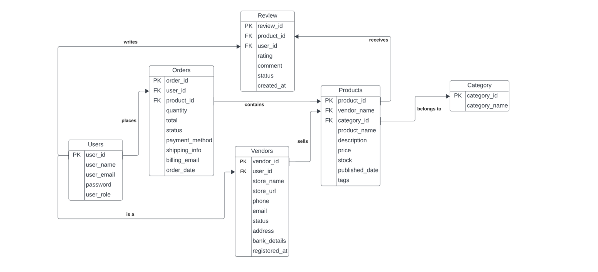
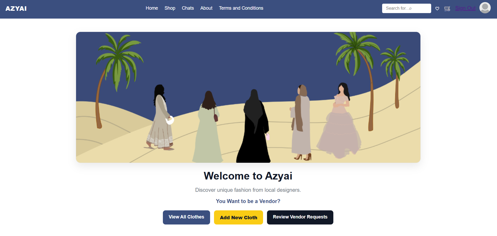
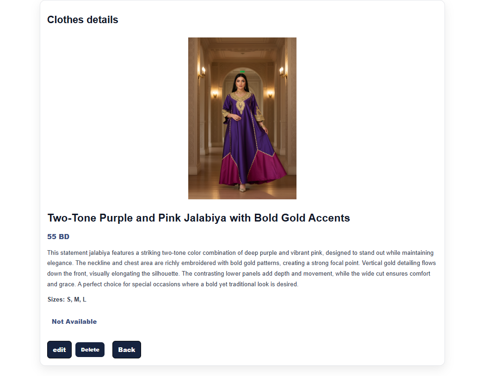

# AZYAI


## App Name & Description

**AZYAI** is a fashion marketplace web app inspired by a multi-vendor e-commerce concept. It lets users browse clothing items, while approved vendors can create and manage their own clothing listings. The app includes an admin workflow to review vendor applications.

### Key Features

* **Authentication**: Sign Up / Sign In / Sign Out
* **Role-based access**:

  * **User**: browse clothes
  * **Vendor**: create/edit/delete *their* clothes
  * **Admin**: manage vendor requests
* **Clothes CRUD**:

  * View all clothes
  * Vendors/Admin can add new clothes
  * Upload multiple images per cloth
  * Show page includes price, sizes, description, availability
* **Vendor Request workflow**:

  * A signed-in user can submit a vendor request
  * Status shown as **Pending / Approved / Rejected**
  * Admin can **Approve/Reject** and leave an **Admin Note**

## Background (Why I built it)

I built **AZYAI** to practice building a full MEN stack CRUD application with authentication and role-based permissions. I wanted the project to feel like a real marketplace, so I added a vendor application flow and an admin review panel to simulate a multi-vendor platform.


### ERD 



### Run Locally

1. **Clone the repo**

   ```bash
   git clone <https://github.com/shahado09/azyai-e-commerce-platform-for-fashion->
   cd azyai
   ```

2. **Install dependencies**

   ```bash
   npm install
   ```

3. **Create a `.env` file**

   ```env
   MONGODB_URI=your_mongodb_connection_string
   SESSION_SECRET=your_session_secret
   EMAIL_USER=your_email
   EMAIL_PASS=your_password_or_app_password
   ADMIN_EMAIL=admin_email_to_receive_requests
   ```

4. **Start the server**

   ```bash
   npm run dev
   # or
   npm start
   ```

5. Open in browser:

   * `http://localhost:3000`


## Technologies Used

* **Node.js**
* **Express.js**
* **MongoDB + Mongoose**
* **EJS** (server-side templates)
* **CSS** (custom responsive styling)
* **Multer** (file upload handling)
* **Method-Override** (PUT/DELETE from forms)
* **Express-Session** (sessions)
* **Nodemailer** (sending vendor request emails to admin)

## Next Steps (Future Enhancements)

Planned stretch goals for AZYAI:

* **User Profile page** (personal info + vendor profile)
* **Orders system** (customer orders, vendor order management)
* **Reviews** (leave reviews on clothes)
* **Favorites / Wishlist**
* **Payment methods / checkout flow**
* **Extra security features**:

  * **Two-Factor Authentication (2FA)**
  * stronger validation and security hardening
* **Direct chat between buyer and seller**
* **Chatbot assistant** to help users with common questions

---
## MVP




